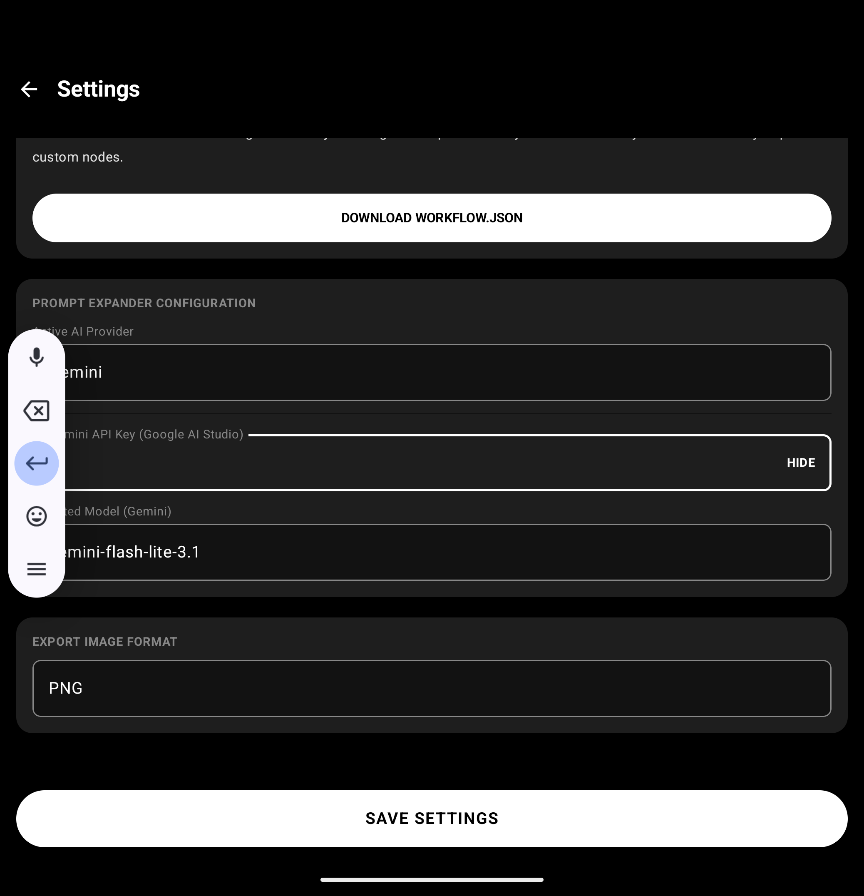

# ComfyUI Client 🎨📱

[](https://developer.android.com)
[](https://kotlinlang.org)
[](https://developer.android.com/jetpack/compose)
[](LICENSE)

**ComfyUI Client** is a state-of-the-art, fully native Android application designed to interface with any ComfyUI server. It allows you to run complex stable diffusion workflows, customize prompts, generate images, and manage generation parameters directly from your pocket.

<p align="center">
  
</p>

> [!NOTE]
> This application communicates directly with your self-hosted ComfyUI instance. No proprietary third-party servers are required!

---

## ✨ Features

### 🔌 Intelligent Core Connectivity
*   **Direct-to-Host Stream**: Integrates seamlessly with your server's REST API and WebSockets for instantaneous response.
*   **Real-time Event Subscriptions**: Subscribes directly to ComfyUI execution events to show actual progress bars and detailed status updates.
*   **Zero Credentials Hardcoded**: All keys and credentials (such as Gemini, Grok, ChatGPT, or Claude prompt-enhancing keys) are stored securely on-device using local encrypted storage and are never committed to code.

### 🧠 Dynamic UI-to-API Workflow Engine
*   **Universal Graph Conversion**: Automatically transforms ComfyUI "UI-format" JSON workflows (nodes + links) into the optimized "API-format" structure required for direct server execution.
*   **Positional Input Alignment**: Dynamically parses the host server's `/object_info` definitions to correctly map connection slots vs widget inputs for custom nodes, eliminating index-shifting and broken parameter assignments.
*   **Dangling Node Recovery & Fallback**: Automatically cleans up links pointing to unsupported custom UI-only nodes while safely mapping default properties (like prompts or values) from `/object_info` definitions, ensuring that missing nodes do not break generation.
*   **Natively Calculated Resolution Injection**: Dynamically intercepts latent/image generators and injects native, aspect-ratio-friendly resolutions calculated directly on your device.

### 🖼️ Seamless Mobile UX
*   **Prompt Enhancer Integration**: Features built-in AI adapters (supporting Gemini, ChatGPT, Claude, and Grok) to expand simple input prompts into beautiful visual styles.
*   **Dynamic Gallery & Viewer**: Stores generation history locally with high-performance caching. Tap any item to view in full-screen, or instantly invoke native Android Share and Download operations.
*   **Settings Suite**: Easily configure host URL, megapixels, desired aspect ratios, and model specifications.

---

## 🛠️ Architecture & Dependencies

This is a modern Android codebase built with the following industry-standard technologies:

*   **Jetpack Compose**: For a fully declarative, high-performance visual experience.
*   **Navigation 3**: To handle seamless Compose screen transitions.
*   **OkHttp (`v4.12.0`)**: Underpins all REST communication and handles stable, persistent WebSocket connections.
*   **Gson (`v2.14.0`)**: Used for parsing highly structured and nested dynamic ComfyUI graphs.
*   **Coil (`v2.7.0`)**: Premium asynchronous image loading and caching optimized for dynamic mobile grids.

---

## 🚀 Getting Started

### Prerequisites
1. Ensure your ComfyUI server is running and accessible over your local network or via a public tunnel (e.g., ngrok).
2. For testing on the Android Emulator, the default connection is configured to loop back to the emulator host at `http://10.0.2.2:8188`.

### Building from Source
You can compile and run the project using Android Studio or directly via the terminal:

```bash
# Clean and assemble the debug APK
./gradlew assembleDebug

# Install to a connected device or emulator
./gradlew installDebug
```

---

## 🔮 Future Roadmap

We are active developers looking to mold this client into the ultimate mobile generative experience. Here is what is planned next:

*   **Cloud Host Integrations**: Support for direct orchestration with GPU providers like **RunPod** and other serverless compute providers.
*   **Server Queue Management**: Full native interfaces to queue, pause, clear, and prioritize ComfyUI jobs directly from the device.
*   **Mobile-Optimized Tweaks**: Custom user interfaces for editing seed models, sampler configurations, and native node parameters in simple cards.
*   **Multi-Platform Support (iOS)**: If there is sufficient interest and backing, we plan to release a premium paid application on both Google Play Store and Apple App Store to support continued development.

---

## 📄 License

This project is licensed under the MIT License. See [LICENSE](LICENSE) for details.
