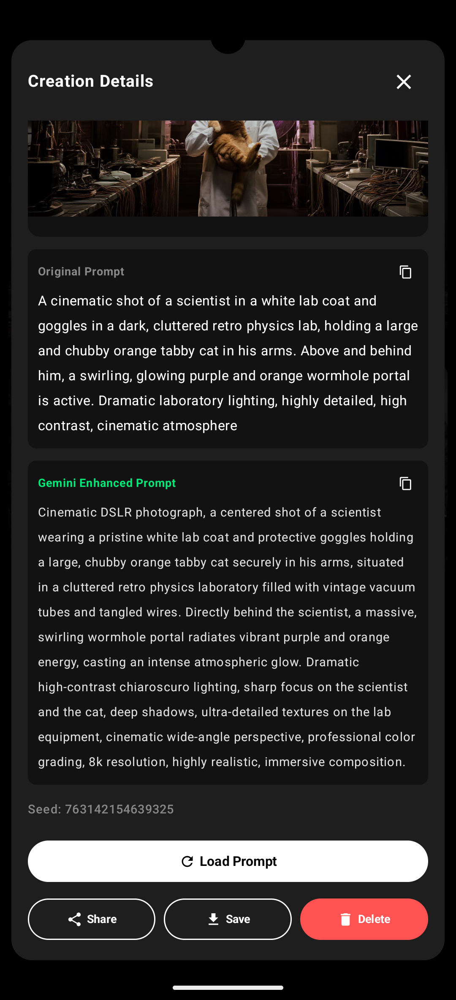
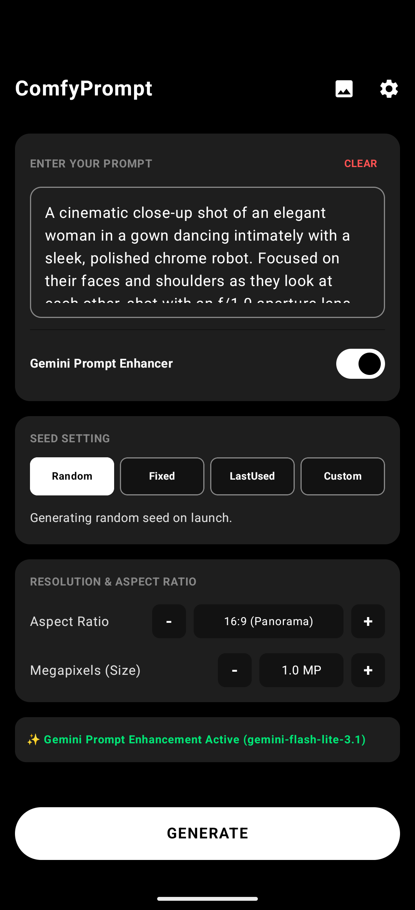
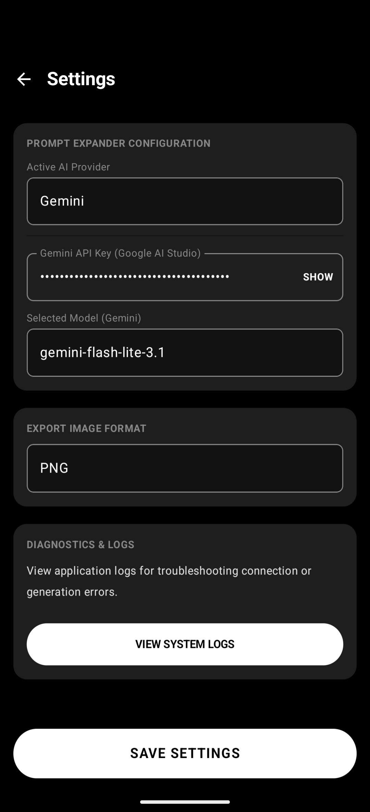
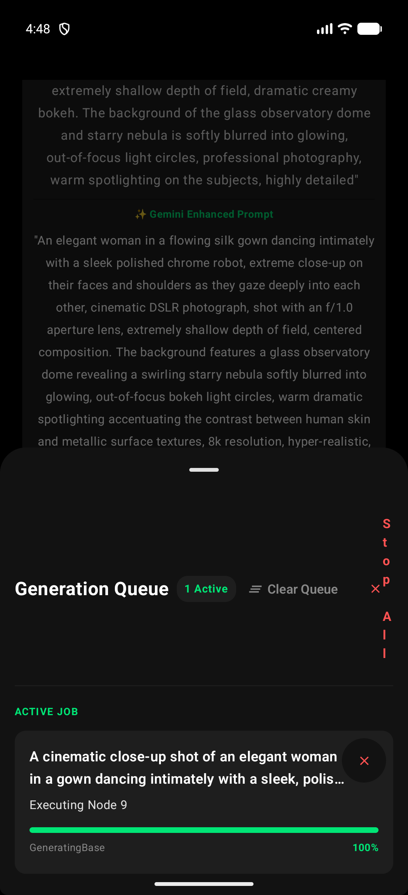

# ComfyUI Client 🎨📱

[](https://developer.android.com)
[](https://kotlinlang.org)
[](https://developer.android.com/jetpack/compose)
[](LICENSE)

**ComfyUI Client** is a state-of-the-art, fully native Android application designed to interface with any ComfyUI server. It allows you to run complex stable diffusion workflows, customize prompts, generate images, and manage generation parameters directly from your pocket.

## 📱 App Showcase & Feature Tour

### 🎨 Core Prompt & Connection Interface
Explore the core generation environment, including standard aspect ratios, resolution modifiers, and secure local/cloud configurations:

| 🏠 01. Main Prompter (Portrait) | ⚙️ 02. Active Connections Setup | 📈 03. Active Run Progress |
| :---: | :---: | :---: |
|  |  |  |
| Enter prompts, choose seeds, and customize outputs easily. | Secure local connection and Active AI Prompt Expander setup. | Real-time generation percentage and base/intermediate image views. |

---

### 🧠 Multimodal Vision Refiner (Gemini 3.5 Flash)
Tweak, refine, and visually context-align your generation prompts through fully in-RAM vision conversation:

| 💬 04. Refiner Chat Intro | 📎 05. Multimodal Attachments & Suggestions |
| :---: | :---: |
|  |  |
| Transient Vision Assistant analyzes active output for context. | Upload reference context files, dictation support, and view prompt suggests. |

---

### 🖼️ Creations History & Detail Gallery
Browse past generations, save locally, share natively, or instantly reload and refine prompts from history:

| 🗃️ 06. Local Creations Grid | 📑 07. Details Popup Card | 🔍 08. Zoomed Immersive View |
| :---: | :---: | :---: |
|  |  |  |
| OLED historical creation grids with cached high-performance cells. | Reload prompts, copy enhanced models, or trigger past vision refinement. | High-performance ZoomableImage canvas overlays. |

---

### 📖 Unfolded Foldable/Tablet Interface
Enjoy premium large screen partitioning:

| 🗺️ 09. OLED Side-by-Side Split View (Unfolded Tablet / Foldable) |
| :---: |
|  |
| Left pane holds prompter details and system action controls, right pane holds the active prompt vision refiner panel side-by-side. |

> [!NOTE]
> This application communicates directly with your self-hosted ComfyUI instance. No proprietary third-party servers are required!

---

## ✨ Features

### 🔌 Intelligent Core Connectivity
*   **Direct-to-Host Stream**: Integrates seamlessly with your server's REST API and WebSockets for instantaneous response.
*   **Real-time Event Subscriptions**: Subscribes directly to ComfyUI execution events to show actual progress bars and detailed status updates.
*   **Zero Credentials Hardcoded**: All keys and credentials (such as Gemini, Grok, ChatGPT, or Claude prompt-enhancing keys) are stored securely on-device using local encrypted storage and are never committed to code.

### 🧠 Dynamic UI-to-API Workflow Engine
*   **Universal Graph Conversion**: Automatically transforms ComfyUI "UI-format" JSON workflows (nodes + links) into the optimized "API-format" structure required for direct server execution.
*   **Positional Input Alignment**: Dynamically parses the host server's `/object_info` definitions to correctly map connection slots vs widget inputs for custom nodes, eliminating index-shifting and broken parameter assignments.
*   **Dangling Node Recovery & Fallback**: Automatically cleans up links pointing to unsupported custom UI-only nodes while safely mapping default properties (like prompts or values) from `/object_info` definitions, ensuring that missing nodes do not break generation.
*   **Natively Calculated Resolution Injection**: Dynamically intercepts latent/image generators and injects native, aspect-ratio-friendly resolutions calculated directly on your device.

### 🖼️ Seamless Mobile UX
*   **Prompt Enhancer Integration**: Features built-in AI adapters (supporting Gemini, ChatGPT, Claude, Grok, and local/custom OpenAI-compatible endpoints) to expand simple input prompts into beautiful visual styles.
*   **Vision-Powered Refiner Chat**: Transient, fully in-RAM vision dialog utilizing background Gemini 3.5 Flash. Upload gallery reference photos, dictate prompts with local microphone input, and review side-by-side prompt suggestions.
*   **Interactive Creations Refinery**: Click any previous output in the Gallery to instantly reload or refine the prompt with vision chat overlays.
*   **Granular Multi-Job Queue**: Floating Queue FAB showing active generation counts with detailed bottom sheet split action controls: "Clear Queue" (clears pending jobs, leaving the active one intact) and "Stop All" (aborts current generation and empties the queue).
*   **Dynamic Gallery & Viewer**: Stores generation history locally with high-performance caching. Tap any item to view in full-screen, or instantly invoke native Android Share and Download operations.
*   **Settings Suite**: Easily configure host URL, megapixels, desired aspect ratios, and model specifications.

---

## 🛠️ Architecture & Dependencies

This is a modern Android codebase built with the following industry-standard technologies:

*   **Jetpack Compose**: For a fully declarative, high-performance visual experience.
*   **Navigation 3**: To handle seamless Compose screen transitions.
*   **OkHttp (`v4.12.0`)**: Underpins all REST communication and handles stable, persistent WebSocket connections.
*   **Gson (`v2.14.0`)**: Used for parsing highly structured and nested dynamic ComfyUI graphs.
*   **Coil (`v2.7.0`)**: Premium asynchronous image loading and caching optimized for dynamic mobile grids.

---

## 🚀 Getting Started

### Prerequisites
1.  **Install the API Converter Extension**:
    To run raw custom workflows in "UI-format", your ComfyUI server must have the [Workflow to API Converter Endpoint](https://github.com/SethRobinson/comfyui-api-endpoint) extension installed.
    *   **How it Works**: 
        - This extension exposes a custom API endpoint (`POST /workflow/convert`) directly on your ComfyUI host server.
        - When the Android app imports a raw, full-fledged ComfyUI UI-format JSON (nodes + links), it POSTs this graph to `/workflow/convert`.
        - The backend extension processes the graph using ComfyUI's native internal execution engine to resolve all connections, inputs, and widgets, translating it into the strict, clean "API-format" execution payload (`prompt` JSON) expected by the ComfyUI server queue.
        - During conversion, the engine automatically respects and bridges **Muted** (`mode: 2`) and **Bypassed** (`mode: 4`) nodes, ensuring your workflow behaves exactly on mobile as it does in your browser.
    *   **Installation**:
        - Open ComfyUI, open the **ComfyUI Manager**, and search for `"Workflow to API Converter Endpoint"`.
        - Click **Install** and restart your ComfyUI server.
    *   *Note*: This extension is **not** required if you import workflows pre-saved in API-format (via Developer Mode in ComfyUI Web UI) or use the application's built-in default workflow.
2.  **Enable Dev Mode in ComfyUI** (Optional): If you prefer to manually import pre-converted API-format workflows directly, enable Developer Mode in your ComfyUI web interface settings: open the settings gear icon, and check **"Enable Dev mode"**. Then click **"Save (API format)"** to download the converted JSON.
3.  Ensure your ComfyUI server is running and accessible over your local network or via a public tunnel (e.g., ngrok).
4.  For testing on the Android Emulator, the default connection is configured to loop back to the emulator host at `http://10.0.2.2:8188`.

### 🤖 Local / Custom Prompt Expander Setup
You can use a local or custom OpenAI-compatible API provider (e.g., LM Studio, Ollama, Llama.cpp) to expand your prompts.
1. Run your local LLM server on your host machine.
2. In the app's **Settings**, set **Active AI Provider** to `Local / Custom`.
3. Enter the **Local LLM Base URL**.
   * When using the Android Emulator, connect to your host machine's local server using the gateway IP `10.0.2.2`. For example, LM Studio running on port 1234 would be `http://10.0.2.2:1234/v1`.
4. Click **Fetch Models** to dynamically query the server's `/models` endpoint.
5. Select your desired model from the dropdown.

### Building from Source
You can compile and run the project using Android Studio or directly via the terminal:

```bash
# Clean and assemble the debug APK
export JAVA_HOME="/Applications/Android Studio.app/Contents/jbr/Contents/Home"
./gradlew assembleDebug

# Install to a connected device or emulator
./gradlew installDebug
```

---

## 🔮 Future Roadmap

We are active developers looking to mold this client into the ultimate mobile generative experience. Here is what is planned next:

*   **Toggle Groups**: Support for toggling LiteGraph groups directly from the Android app UI to enable/disable entire workflow segments.
*   **Cloud Host Integrations**: Support for direct orchestration with GPU providers like **RunPod** and other serverless compute providers.
*   **Server Queue Management**: Full native interfaces to queue, pause, clear, and prioritize ComfyUI jobs directly from the device.
*   **Mobile-Optimized Tweaks**: Custom user interfaces for editing seed models, sampler configurations, and native node parameters in simple cards.
*   **Multi-Platform Support (iOS)**: If there is sufficient interest and backing, we plan to release a premium paid application on both Google Play Store and Apple App Store to support continued development.

---

## 📄 License

This project is licensed under the MIT License. See [LICENSE](LICENSE) for details.
