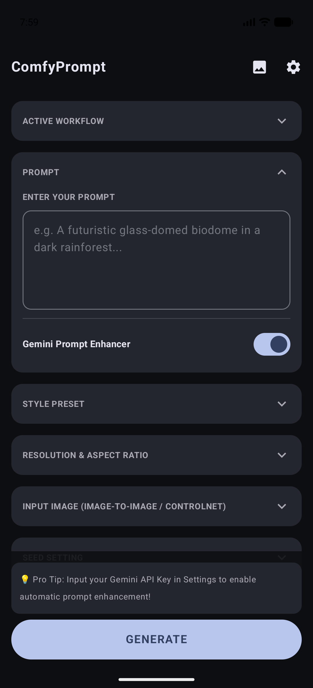
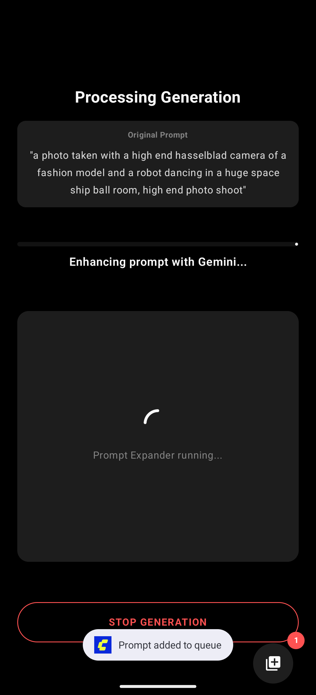
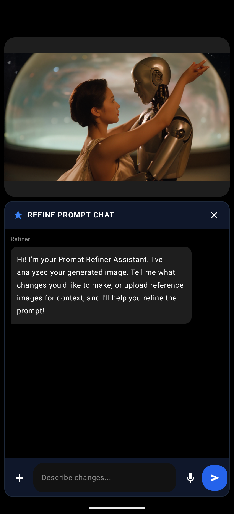
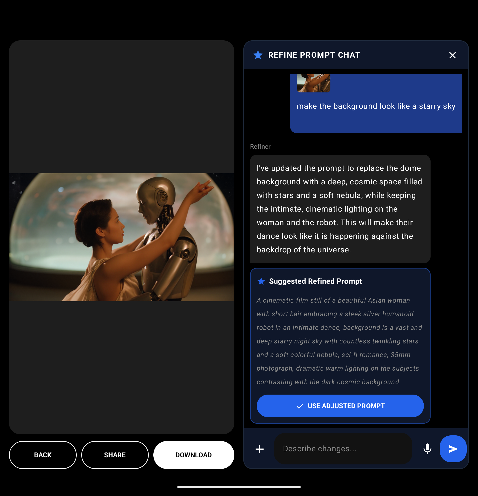

# ComfyUI Client 🎨📱

[](https://developer.android.com)
[](https://kotlinlang.org)
[](https://developer.android.com/jetpack/compose)
[](CHANGELOG.md)
[](LICENSE)

**ComfyUI Client** is a fully native Android application designed to interface with your ComfyUI server. 

Let's be completely honest: trying to use ComfyUI's dense, node-based desktop layout inside Chrome or Safari on a mobile screen is an exercise in pure frustration. Panning, zooming, and dragging spaghetti connection links on a 6-inch display is a recipe for accidental node mutations and lost patience. And nobody wants to spend hours manually converting every single custom workflow into a standalone app using ComfyUI's Node 2.0 app framework. 

This client was born out of a simple, selfish need: **just let me prompt and go.** It hooks up your existing backend workflows and lets you run them natively on your phone or tablet with high-fidelity, touch-friendly mobile layouts. 

## 📱 App Showcase & Feature Tour

### 🎨 Core Prompt & Connection Interface
Explore the core generation environment, including standard aspect ratios, resolution modifiers, and secure local/cloud configurations:

| 🏠 01. Main Prompter (Portrait) | ⚙️ 02. Active Connections Setup | 📈 03. Active Run Progress |
| :---: | :---: | :---: |
|  |  |  |
| Enter prompts, choose seeds, and customize outputs easily. | Secure local connection and Active AI Prompt Expander setup. | Real-time generation percentage and base/intermediate image views. |

---

### 🧠 Multimodal Vision Refiner (Gemini 3.5 Flash)
Tweak, refine, and visually context-align your generation prompts through fully in-RAM vision conversation:

| 💬 04. Refiner Chat Intro | 📎 05. Multimodal Attachments & Suggestions |
| :---: | :---: |
|  |  |
| Transient Vision Assistant analyzes active output for context. | Upload reference context files, dictation support, and view prompt suggests. |

---

### 🖼️ Creations History & Detail Gallery
Browse past generations, save locally, share natively, or instantly reload and refine prompts from history:

| 🗃️ 06. Local Creations Grid | 📑 07. Details Popup Card |
| :---: | :---: |
|  |  |
| OLED historical creation grids with cached high-performance cells. | Reload prompts, copy enhanced models, or trigger past vision refinement. |

---

### 📖 Unfolded Foldable/Tablet Interface
Enjoy premium large screen partitioning:

| 🗺️ 09. OLED Side-by-Side Split View (Unfolded Tablet / Foldable) |
| :---: |
|  |
| Left pane holds prompter details and system action controls, right pane holds the active prompt vision refiner panel side-by-side. |

> [!NOTE]
> This application communicates directly with your self-hosted ComfyUI instance. No proprietary third-party servers are required!

---

## ✨ Features

### 🔌 Intelligent Core Connectivity
*   **Direct-to-Host Stream**: Integrates seamlessly with your server's REST API and WebSockets for instantaneous response.
*   **Real-time Event Subscriptions**: Subscribes directly to ComfyUI execution events to show actual progress bars and detailed status updates.
*   **Zero Credentials Hardcoded**: All keys and credentials (such as Gemini, Grok, ChatGPT, or Claude prompt-enhancing keys) are stored securely on-device using local encrypted storage and are never committed to code.
*   **Background-Resilient Generation**: Generation state is owned by a `GenerationRepository` running on a `SupervisorJob` scope, so backgrounding or rotating the device does not drop the active WebSocket connection or lose progress.

### 🧠 Dynamic UI-to-API Workflow Engine
*   **Universal Graph Conversion**: Automatically transforms ComfyUI "UI-format" JSON workflows (nodes + links) into the optimized "API-format" structure required for direct server execution.
*   **Positional Input Alignment**: Dynamically parses the host server's `/object_info` definitions to correctly map connection slots vs widget inputs for custom nodes, eliminating index-shifting and broken parameter assignments.
*   **Dangling Node Recovery & Fallback**: Automatically cleans up links pointing to unsupported custom UI-only nodes while safely mapping default properties (like prompts or values) from `/object_info` definitions, ensuring that missing nodes do not break generation.
*   **Natively Calculated Resolution Injection**: Dynamically intercepts latent/image generators and injects native, aspect-ratio-friendly resolutions calculated directly on your device.
*   **`WorkflowTransformer`**: Prompt injection is handled by a dedicated transformer that recursively walks the graph to find `CLIPTextEncode` and `PrimitiveNode` targets — no more brittle index assumptions.

### 🖼️ Seamless Mobile UX
*   **Prompt Enhancer Integration**: Features built-in AI adapters (supporting Gemini, ChatGPT, Claude, Grok, and local/custom OpenAI-compatible endpoints) to expand simple input prompts into beautiful visual styles.
*   **Collapsible Enhanced-Prompt Card**: On the Progress Screen, the AI-enhanced prompt starts collapsed to a 3-line tappable preview. Tap to smoothly expand the full text and tap again to collapse — keeping generation progress always visible without scrolling.
*   **Vision-Powered Refiner Chat**: Transient, fully in-RAM vision dialog utilizing background Gemini Flash. Upload gallery reference photos, dictate prompts with local microphone input, and review side-by-side prompt suggestions.
*   **Interactive Creations Refinery**: Click any previous output in the Gallery to instantly reload or refine the prompt with vision chat overlays.
*   **Granular Multi-Job Queue**: Floating Queue FAB showing active generation counts with detailed bottom sheet split action controls: "Clear Queue" (clears pending jobs, leaving the active one intact) and "Stop All" (aborts current generation and empties the queue).
*   **Dynamic Gallery & Viewer**: Stores generation history locally with high-performance caching. Tap any item to view in full-screen, or instantly invoke native Android Share and Download operations.
*   **Settings Suite**: Easily configure host URL, megapixels, desired aspect ratios, and model specifications.

### 🌐 Smart Server Wake (TRIGGERcmd)
*   **Auto-Wake on Connection Failure**: If the local ComfyUI host is unreachable, the app can optionally fire a TRIGGERcmd cloud relay command to power on your server, then poll until it's back online before proceeding — no manual intervention required.

---

## 🛠️ Architecture & Dependencies

This is a modern Android codebase built with the following industry-standard technologies:

*   **Jetpack Compose**: For a fully declarative, high-performance visual experience.
*   **Navigation 3**: To handle seamless Compose screen transitions.
*   **OkHttp (`v4.12.0`)**: Underpins all REST communication and handles stable, persistent WebSocket connections.
*   **Gson (`v2.14.0`)**: Used for parsing highly structured and nested dynamic ComfyUI graphs.
*   **Coil (`v2.7.0`)**: Premium asynchronous image loading and caching optimized for dynamic mobile grids.

---

## 🚀 Getting Started

### Prerequisites
1.  **Install the API Converter Extension**:
    To run raw custom workflows in "UI-format", your ComfyUI server must have the [Workflow to API Converter Endpoint](https://github.com/SethRobinson/comfyui-api-endpoint) extension installed.
    *   **How it Works**: 
        - This extension exposes a custom API endpoint (`POST /workflow/convert`) directly on your ComfyUI host server.
        - When the Android app imports a raw, full-fledged ComfyUI UI-format JSON (nodes + links), it POSTs this graph to `/workflow/convert`.
        - The backend extension processes the graph using ComfyUI's native internal execution engine to resolve all connections, inputs, and widgets, translating it into the strict, clean "API-format" execution payload (`prompt` JSON) expected by the ComfyUI server queue.
        - During conversion, the engine automatically respects and bridges **Muted** (`mode: 2`) and **Bypassed** (`mode: 4`) nodes, ensuring your workflow behaves exactly on mobile as it does in your browser.
    *   **Installation**:
        - Open ComfyUI, open the **ComfyUI Manager**, and search for `"Workflow to API Converter Endpoint"`.
        - Click **Install** and restart your ComfyUI server.
    *   *Note*: This extension is **not** required if you import workflows pre-saved in API-format (via Developer Mode in ComfyUI Web UI) or use the application's built-in default workflow.
2.  **Enable Dev Mode in ComfyUI** (Optional): If you prefer to manually import pre-converted API-format workflows directly, enable Developer Mode in your ComfyUI web interface settings: open the settings gear icon, and check **"Enable Dev mode"**. Then click **"Save (API format)"** to download the converted JSON.
3.  Ensure your ComfyUI server is running and accessible over your local network or via a public tunnel (e.g., ngrok).
4.  For testing on the Android Emulator, the default connection is configured to loop back to the emulator host at `http://10.0.2.2:8188`.

### 🤖 Local / Custom Prompt Expander Setup
You can use a local or custom OpenAI-compatible API provider (e.g., LM Studio, Ollama, Llama.cpp) to expand your prompts.
1. Run your local LLM server on your host machine.
2. In the app's **Settings**, set **Active AI Provider** to `Local / Custom`.
3. Enter the **Local LLM Base URL**.
   * When using the Android Emulator, connect to your host machine's local server using the gateway IP `10.0.2.2`. For example, LM Studio running on port 1234 would be `http://10.0.2.2:1234/v1`.
4. Click **Fetch Models** to dynamically query the server's `/models` endpoint.
5. Select your desired model from the dropdown.

### Building from Source
You can compile and run the project using Android Studio or directly via the terminal:

```bash
# Clean and assemble the debug APK
export JAVA_HOME="/Applications/Android Studio.app/Contents/jbr/Contents/Home"
./gradlew assembleDebug

# Install to a connected device or emulator
./gradlew installDebug
```

---

## 🔮 Feature Roadmap & Milestones

We are molding this client into the ultimate mobile generative experience. Here is what we have accomplished and what is coming next.

See the full [CHANGELOG.md](CHANGELOG.md) for detailed version history.

### 🚀 Recently Completed Features (v1.2.0)
*   **Modular Screen Architecture**: Refactored from a monolithic `Screens.kt` into individual focused screen files for much better maintainability.
*   **Background-Resilient Generation**: `GenerationRepository` owns generation state so backgrounding or rotating the device no longer drops the WebSocket stream.
*   **Collapsible AI Prompt Card**: On the Progress Screen, the enhanced prompt collapses to a tappable 3-line preview — tap to expand or collapse with smooth animation.
*   **TRIGGERcmd Server Wake**: Auto-wake your ComfyUI PC via TRIGGERcmd when it's unreachable, with polling until it's back online.
*   **Fixed Double-Percentage Notifications** (`35% 35%` → `35%`): Sanitized all progress-string update paths.
*   **Cloud Host Integrations**: Orchestration with serverless and GPU providers (including **RunPod Serverless**, **Fal.ai**, and **ComfyDeploy**) with smart local fallback logic.
*   **Active Job Queue Management**: Stop, abort, and clear controls via the Floating Queue FAB bottom sheets (Clear Queue vs. Stop All).
*   **Cryptographically Secure API Storage**: All active model keys stored using Android's native `EncryptedSharedPreferences` (AES-256 GCM).
*   **Universal Graph-to-API Engine**: Position-aligned node widget mapping and dangling link recovery.

### 🔮 Planned Next Steps
*   **Toggle Groups**: Support for toggling LiteGraph groups directly from the Android app UI to enable/disable entire workflow segments.
*   **Multi-Platform Support (iOS)**: If there is sufficient interest and backing, we plan to release a premium paid version on both Google Play Store and Apple App Store to support continued development.

---

## 🤝 The "AI Slop" Confession & Co-Creation Story

Let's address the giant robot in the room: yes, this app is fully vibe-coded. We know the internet is currently drowning in "AI slop" wrappers, half-baked templates, and generic copy-paste projects. But we promise you, this isn't one of those cash-grabs. 

First of all, **this app is not for sale.** It was created by someone who is decidedly *not* a professional developer, but who was simply tired of squinting at a tiny phone screen trying to connect virtual widgets in ComfyUI's web interface. 

To solve this, the creator teamed up with **Antigravity**, a powerful agentic AI coding assistant developed by Google DeepMind. Together, they went full "mad scientist" mode, using **Gemini 3.5 Flash** on its highest settings to hammer out a real, native Android app. 

While the human provided the architectural specifications, the aesthetic direction, and the relentless quality checks, Antigravity handled the heavy lifting under the hood, compiling Kotlin code, setting up WebSocket listeners, and securing encrypted preference managers. 

So yes, it is an AI-assisted build. But it's an AI-assisted build driven by pure, unfiltered laziness and a desire to make ComfyUI actually usable on a couch. And we think that is a beautiful thing.

---

## 🔒 Security, Keys, and Private Context

We hold security and private data context in the highest regard. To ensure complete safety:
*   **Encrypted Storage**: All sensitive API keys (e.g., Gemini, ChatGPT, Claude, Grok, or local server tokens) are stored locally using Android's native `EncryptedSharedPreferences` (AES-256 GCM encryption) inside the private app sandbox. They are never written in plaintext and are never exposed to debug logs.
*   **No Third-Party Telemetry**: The application contains no analytics packages, usage tracking, or external reporting channels. All ComfyUI API calls and WebSocket connections occur directly between your mobile device and your self-hosted host server.
*   **Zero-Exposure Sanitization**: The source code and repository structure have been thoroughly audited and sanitized. Strict `.gitignore` rules prevent private keys, build scripts, local properties, and compiler caches from ever being pushed to version control, ensuring no personal credentials or environment details are exposed.

---

## 📄 License

This project is licensed under the MIT License. See [LICENSE](LICENSE) for details.
