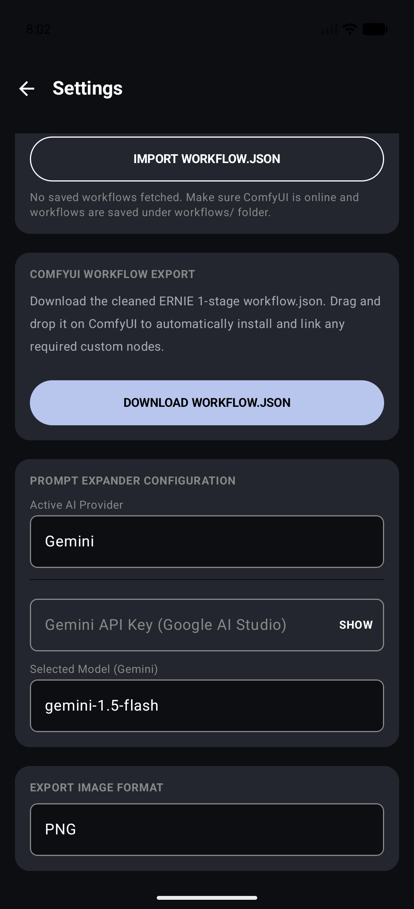
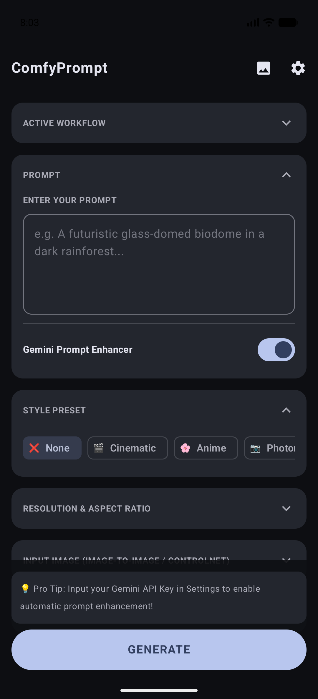
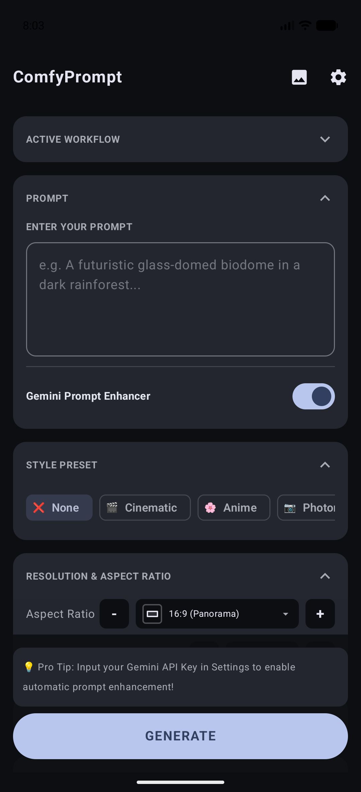
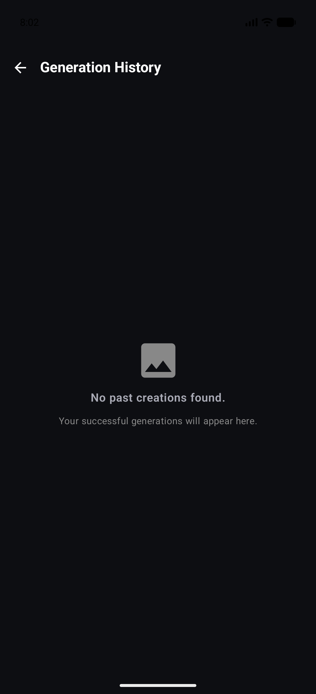

# ComfyUI Client 🎨📱

[](https://developer.android.com)
[](https://kotlinlang.org)
[](https://developer.android.com/jetpack/compose)
[](CHANGELOG.md)
[](LICENSE)

**ComfyUI Client** is a fully native Android app that gives you a clean, touch-friendly mobile interface for your [ComfyUI](https://github.com/comfyanonymous/ComfyUI) image generation server.

Using ComfyUI's node-based desktop UI on a phone screen is genuinely painful — panning spaghetti node graphs on a 6-inch display, accidentally mutating connections, squinting at tiny widgets. This app cuts through all of that. Enter your prompt, pick your settings, tap Generate. That's it.

---

## 📸 Screenshots

| 🏠 Main Prompter | ⚙️ Settings — Host Config | 🤖 Settings — AI Provider |
| :---: | :---: | :---: |
|  |  |  |
| Accordion UI with prompt input and Gemini enhancer toggle | Configure Local, RunPod, ComfyDeploy, or Fal.ai | Gemini/ChatGPT/Claude/Grok or local LLM |

| 🎨 Style Presets | 📐 Resolution & Aspect Ratio | 🖼️ Generation History |
| :---: | :---: | :---: |
|  |  |  |
| One-tap style chips: None, Cinematic, Anime, Photography… | Proportional aspect ratio icons with +/− megapixel controls | Browse, search, and reload past generations |

---

## ✨ Features

### 🎛️ Accordion-Based Prompt UI
Every setting lives in a collapsible card — Active Workflow, Prompt, Style Preset, Resolution & Aspect Ratio, Input Image (img2img/ControlNet), Workflow Stages, and Seed Setting. The GENERATE button stays pinned to the bottom at all times.

### 🧠 AI Prompt Enhancement
Toggle Gemini, ChatGPT, Claude, Grok, or any local OpenAI-compatible LLM (Ollama, LM Studio, llama.cpp) to automatically expand a simple prompt into a rich visual description before sending it to ComfyUI. The enhanced prompt is shown on the progress screen with a one-tap copy to clipboard and a full-screen immersive reader.

### 🗂️ Workflow Stage Toggles
Load any ComfyUI workflow and individually toggle its node groups (e.g., skip upscaling, bypass face restoration) directly from the app. A **master ALL STAGES** switch at the top lets you flip everything at once. Toggle states are remembered between generations.

### 🔌 Flexible Host Connections
- **Local** — direct IP/port to your home ComfyUI instance
- **ComfyDeploy** — cloud-hosted ComfyUI via ComfyDeploy
- **RunPod Serverless** — GPU serverless endpoints
- **Fal.ai** — image generation via Fal.ai API

All API keys and credentials are stored on-device using **AES-256 GCM** encrypted storage (`EncryptedSharedPreferences`) — never written in plaintext, never sent anywhere except the host you configure.

### 📡 Real-Time WebSocket Progress
Subscribes directly to ComfyUI's execution event stream. A visual pipeline stepper shows exactly where you are: **Load Model → Encode → Sampler → Decode → Save**. Progress survives backgrounding and screen rotation — generation keeps running even if you switch apps.

### 🖼️ Generation History Gallery
Every successful generation is stored locally. Search by prompt text, tap to view full-screen, copy the enhanced prompt, share natively, or instantly reload a past prompt to regenerate or refine it.

### 🌐 TRIGGERcmd Server Wake
If your local ComfyUI PC is off or asleep, the app can fire a [TRIGGERcmd](https://triggercmd.com) cloud relay command to wake it up, then poll until it comes online — no manual intervention needed.

### 🤖 Vision Refiner (Gemini Multimodal)
Attach reference images and have a back-and-forth Gemini conversation to refine your prompt before generating. Dictation support included.

---

## 🛠️ Tech Stack

| Layer | Technology |
|---|---|
| UI | Jetpack Compose + Material 3 (dynamic Monet theming) |
| Navigation | Navigation 3 |
| Networking | OkHttp 4 (REST + persistent WebSockets) |
| JSON | Gson |
| Image Loading | Coil |
| Secure Storage | EncryptedSharedPreferences (AES-256 GCM) |
| Language | Kotlin 2.x |
| Min SDK | API 24 (Android 7.0) |

---

## 🚀 Getting Started

### Prerequisites
1. A running **ComfyUI server** accessible over your local network or via a public tunnel.
2. *(Optional)* The [Workflow to API Converter](https://github.com/SethRobinson/comfyui-api-endpoint) ComfyUI extension, if you want to import raw UI-format workflow JSON files directly.
3. A Gemini API key from [Google AI Studio](https://aistudio.google.com) if you want AI prompt enhancement.

### Install the APK
Grab the latest debug APK from the [Releases](https://github.com/williamcboehmjr/comfyui-client-android/releases) page and sideload it onto your Android device.

### Build from Source

```bash
# Requires Android Studio's bundled JDK
export JAVA_HOME="/Applications/Android Studio.app/Contents/jbr/Contents/Home"

# Assemble debug APK
./gradlew assembleDebug

# Install directly to a connected device or emulator
./gradlew installDebug
```

> **Emulator note**: The default local server address is `http://10.0.2.2:8188`, which routes to your host machine from the Android emulator.

---

## 🤖 How It Was Built

This app is fully vibe-coded. Not by a professional developer — by someone who was just tired of using ComfyUI on their phone and decided to do something about it.

The human provided the product direction, UI specs, feature ideas, and relentless quality checks. **[Antigravity](https://deepmind.google)** — Google DeepMind's agentic AI coding assistant — handled all the Kotlin, Compose, WebSocket plumbing, and encrypted storage implementation.

Is it AI slop? No. Is it AI-assisted? Absolutely. But it's AI-assisted by genuine frustration with a real problem, and that makes all the difference.

---

## 🔒 Security

- API keys (Gemini, ChatGPT, Claude, Grok, etc.) are stored using Android's `EncryptedSharedPreferences` with AES-256 GCM encryption inside the private app sandbox.
- No analytics, no telemetry, no third-party tracking — ever.
- All ComfyUI API calls go directly from your device to your server, nowhere else.

---

## 📄 License

MIT License — see [LICENSE](LICENSE) for details.
